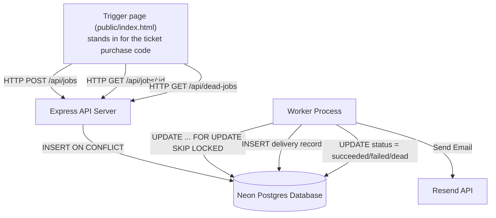
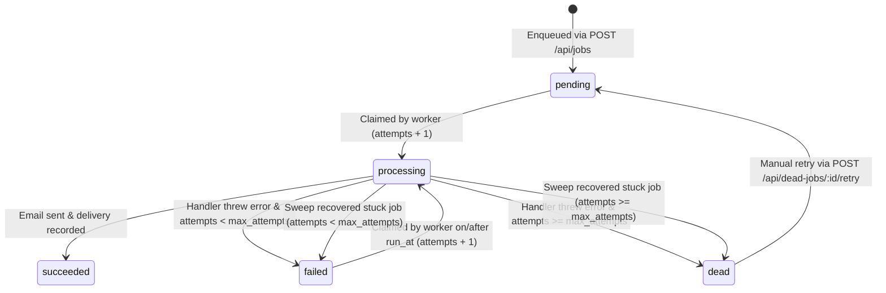

# Background Job Queue System

## What this is

This project sends ticket confirmation emails in the background. It is built with Node.js, Express, TypeScript, and Postgres on Neon.

You send the API a request. The API saves it as a "job" in the database and answers straight away. It does not send the email itself. A separate program, called the worker, picks up the job later and sends the email through Resend (an email service).

If sending fails, the worker tries again, waiting a bit longer each time. If a job fails too many times, it is marked `dead` and waits for a person to look at it and retry it.

## Why there is a form, and what happens in real life

In a real product, nobody types into a form. In production, the ticket purchase code would call `POST /api/jobs` by itself, sending the buyer's details. The buyer sees "ticket confirmed" instantly, and the worker sends the email a moment later.

This project does not include a ticket purchase flow, because that is outside the brief. The page at `public/index.html` stands in for it. Filling in the form and pressing submit does exactly what the purchase code would do: it calls `POST /api/jobs`. That lets you watch a job move through its statuses on screen.

The page at `public/dead.html` is the "problem pile". It lists jobs that ran out of retries, and lets a person retry them.

## How it works

### The four parts

1. **Express API** (the front desk). It receives requests to create a job or check a job. It writes the job to the database with status `pending` and replies immediately. It never sends email and never makes the caller wait.
2. **Postgres database** (the memory). It holds three tables: `jobs` (each job's state, data, attempts and errors), `email_deliveries` (a record of every email actually sent), and `schema_migrations` (which database setup files have already run).
3. **Worker** (the one who does the work). It runs as its own separate process. It keeps claiming jobs that are `pending` or `failed`, builds and sends the email through Resend, records the delivery, and decides what happens next if something goes wrong.
4. **Resend** (the email service). The worker calls it to send each email.



### The life of a job

Every job is always in exactly one of five statuses:

- `pending`: new, waiting for a worker.
- `processing`: a worker has it right now.
- `succeeded`: the email was sent and recorded.
- `failed`: the last try went wrong, and it will be tried again after a wait.
- `dead`: it ran out of tries. A person needs to look at it.



## Setup from a fresh clone

You need Node.js 20 or newer, a Neon Postgres database, and a Resend account.

Resend only lets you email your own account address until you verify a sending domain. To email other people, verify a domain in Resend and use an address on that domain as `EMAIL_FROM`.

```bash
# 1. Install dependencies
npm install

# 2. Copy the environment template and fill in your credentials
cp .env.example .env
# Edit .env with your Neon DATABASE_URL, RESEND_API_KEY, and EMAIL_FROM

# 3. Run database migrations
npm run migrate

# 4. Start the Express API server (Development mode)
npm run dev:api

# 5. In a separate terminal, start the worker process (Development mode)
npm run dev:worker
```

Then open `http://localhost:3000/` to send a test job, and `http://localhost:3000/dead.html` to see dead jobs.

The app reads `.env` only when it starts. If you change `.env`, stop the API and the worker and start them again.

## Environment variables

Variables are loaded from `.env` when the app starts, using `dotenv`. If a required variable is missing, the app stops right away with a clear error message.

| Variable | Required | Default | Description |
| --- | --- | --- | --- |
| `DATABASE_URL` | Yes | - | Neon Postgres connection string with SSL enabled. |
| `RESEND_API_KEY` | Yes | - | API key for the Resend email service. |
| `EMAIL_FROM` | Yes | - | Sender address on your verified Resend domain, for example `hello@yourdomain.com`, or `Name <hello@yourdomain.com>`. |
| `PORT` | No | `3000` | Port the API listens on. |
| `MAX_ATTEMPTS` | No | `5` | Most tries a job gets before it is marked `dead`. |
| `BACKOFF_BASE_MS` | No | `1000` | Starting wait between retries, in milliseconds. |
| `BACKOFF_JITTER_MS` | No | `500` | Most random extra wait added to each retry delay, in milliseconds. |
| `CONCURRENCY` | No | `3` | Most jobs one worker runs at the same time. |
| `POLL_INTERVAL_MS` | No | `1000` | How often a worker looks for new jobs, in milliseconds. |
| `STUCK_TIMEOUT_MS` | No | `300000` | How long a job can sit in `processing` before it counts as stuck (5 minutes). |
| `SWEEP_INTERVAL_MS` | No | `30000` | How often the stuck job cleanup runs (30 seconds). |
| `WORKER_ID` | No | Random | A name for this worker, shown in the logs. |
| `EMAIL_MODE` *(Test Knob)* | No | `live` | `live` sends real emails through Resend. `dry` skips Resend and makes up a message ID. |
| `SIMULATE_FAILURE_RATE` *(Test Knob)* | No | `0` | Chance (0 to 1) that the job throws a fake error before sending. |
| `SIMULATE_DELAY_MS` *(Test Knob)* | No | `0` | Extra wait inside the job before sending, in milliseconds. Makes jobs slow. |
| `SIMULATE_CRASH_AFTER_SEND` *(Test Knob)* | No | `false` | When `true`, the worker process exits (`process.exit(1)`) right after Resend accepts the email, on attempt 1 only. |

The test knobs are only for the break-it tests. Leave them at their defaults for normal use.

## Configuration

All tunable numbers live in `src/config.ts`. Route handlers and worker code import from that file. No limits or timings are hardcoded anywhere else.

| Setting | Default | What it does |
| --- | --- | --- |
| `maxAttempts` | `5` | After this many tries, a failing job becomes `dead`. |
| `backoffBaseMs` | `1000` | The base of the retry wait. The wait grows as `base * 2^attempts`. |
| `backoffJitterMs` | `500` | A random extra wait, so many failed jobs do not all retry at the same moment. |
| `concurrency` | `3` | The most jobs a worker runs at once. |
| `pollIntervalMs` | `1000` | How long a worker sleeps between checks when there is nothing to do. |
| `stuckTimeoutMs` | `300000` (5 min) | How long a job can stay in `processing` before it is treated as stuck. |
| `sweepIntervalMs` | `30000` (30 sec) | How often the stuck job cleanup runs. |
| `port` | `3000` | Port for the API. |

## API reference

Every response uses one of two shapes:

- **Success:** `{ "data": ... }`, sometimes with `"meta": { ... }`
- **Error:** `{ "error": { "code": "...", "message": "..." } }`

---

### 1. Enqueue Job

Creates a job. Use this the way the ticket purchase code would.

- **Method / Path**: `POST /api/jobs`
- **Headers**:
  - `Content-Type: application/json`
  - `Idempotency-Key`: required, a string of 1 to 200 characters. It is a label for this request. Sending the same label twice returns the same job instead of making a second one.
- **Request Body**:
  ```json
  {
    "type": "send_ticket_confirmation",
    "payload": {
      "to": "delivered@resend.dev",
      "recipientName": "Alice Smith",
      "eventTitle": "Tech Conference 2026",
      "ticketId": "TC-998811"
    }
  }
  ```
- **Status Codes**:
  - `202 Accepted`: a new job was created.
  - `200 OK`: this key was already used with the same data, so the existing job is returned.
  - `400 Bad Request`: the `Idempotency-Key` header is missing, or the JSON is broken.
  - `409 Conflict`: this key was already used with different data (`IDEMPOTENCY_CONFLICT`).
  - `422 Unprocessable Entity`: the body is invalid, for example `payload.to must be a valid email`.
  - `500 Internal Server Error`: something unexpected went wrong.
- **cURL Example**:
  ```bash
  curl -i -X POST http://localhost:3000/api/jobs \
    -H "Content-Type: application/json" \
    -H "Idempotency-Key: ticket-confirmation/TC-998811" \
    -d '{
      "type": "send_ticket_confirmation",
      "payload": {
        "to": "delivered@resend.dev",
        "recipientName": "Alice Smith",
        "eventTitle": "Tech Conference 2026",
        "ticketId": "TC-998811"
      }
    }'
  ```
- **Example Response (202 Accepted)**:
  ```json
  {
    "data": {
      "id": "3abbbaec-42ab-4c74-942a-a0c08b98d4c7",
      "type": "send_ticket_confirmation",
      "status": "pending",
      "attempts": 0,
      "maxAttempts": 5,
      "lastError": null,
      "runAt": "2026-09-28T04:12:37.290Z",
      "createdAt": "2026-09-28T04:12:37.290Z"
    },
    "meta": {
      "duplicate": false
    }
  }
  ```

---

### 2. Get Job Status

Shows what is happening with one job.

- **Method / Path**: `GET /api/jobs/:id`
- **Status Codes**:
  - `200 OK`: job found. The payload is left out, because it contains the recipient's email address.
  - `404 Not Found`: `:id` is not a valid UUID, or no such job exists.
  - `500 Internal Server Error`: something unexpected went wrong.
- **cURL Example**:
  ```bash
  curl -i http://localhost:3000/api/jobs/3abbbaec-42ab-4c74-942a-a0c08b98d4c7
  ```
- **Example Response (200 OK)**:
  ```json
  {
    "data": {
      "id": "3abbbaec-42ab-4c74-942a-a0c08b98d4c7",
      "type": "send_ticket_confirmation",
      "status": "pending",
      "attempts": 0,
      "maxAttempts": 5,
      "lastError": null,
      "runAt": "2026-09-28T04:12:37.290Z",
      "startedAt": null,
      "finishedAt": null,
      "createdAt": "2026-09-28T04:12:37.290Z"
    }
  }
  ```

---

### 3. List Dead Jobs

Lists jobs that ran out of retries.

- **Method / Path**: `GET /api/dead-jobs`
- **Status Codes**:
  - `200 OK`: returns the latest 50 jobs with status `dead`.
- **cURL Example**:
  ```bash
  curl -i http://localhost:3000/api/dead-jobs
  ```
- **Example Response (200 OK)**:
  ```json
  {
    "data": [
      {
        "id": "da338b5d-7bd8-4b13-8489-d1d68ab8cf8b",
        "type": "send_ticket_confirmation",
        "payload": {
          "to": "delivered@resend.dev",
          "recipientName": "Dead Page Demo",
          "eventTitle": "Dead Letter Festival",
          "ticketId": "DEAD-DEMO-99"
        },
        "attempts": 5,
        "maxAttempts": 5,
        "lastError": "Simulated failure",
        "createdAt": "2026-09-28T11:01:09.643Z",
        "finishedAt": "2026-09-28T11:01:21.091Z"
      }
    ]
  }
  ```

---

### 4. Retry Dead Job

Puts a dead job back in the queue for a fresh set of tries.

- **Method / Path**: `POST /api/dead-jobs/:id/retry`
- **Status Codes**:
  - `200 OK`: the job is reset to `pending` with `attempts = 0`.
  - `404 Not Found`: `:id` is not a valid UUID, or no such job exists.
  - `409 Conflict`: the job exists but is not `dead` (`NOT_DEAD`).
- **cURL Example**:
  ```bash
  curl -i -X POST http://localhost:3000/api/dead-jobs/da338b5d-7bd8-4b13-8489-d1d68ab8cf8b/retry
  ```
- **Example Response (200 OK)**:
  ```json
  {
    "data": {
      "id": "da338b5d-7bd8-4b13-8489-d1d68ab8cf8b",
      "type": "send_ticket_confirmation",
      "status": "pending",
      "attempts": 0,
      "maxAttempts": 5,
      "lastError": "Simulated failure",
      "runAt": "2026-09-28T11:02:22.898Z",
      "createdAt": "2026-09-28T11:01:09.643Z"
    }
  }
  ```

---

### 5. Health Check

Checks that the API is running and can reach the database.

- **Method / Path**: `GET /health`
- **Status Codes**:
  - `200 OK`: the API and the Postgres connection both work.
- **cURL Example**:
  ```bash
  curl -i http://localhost:3000/health
  ```
- **Example Response (200 OK)**:
  ```json
  {
    "data": {
      "status": "ok"
    }
  }
  ```

## Design decisions

Each decision lists the option that was considered and why it lost.

1. **Postgres as the queue, not Redis or a queue library (such as BullMQ)**
   - *Considered*: Redis with BullMQ, or RabbitMQ.
   - *Why it lost*: Postgres is already needed, so there is nothing extra to run. Jobs and their data stay consistent in one place, and the claim can be written as one SQL statement (`FOR UPDATE SKIP LOCKED`).

2. **Two separate states, `failed` and `dead`**
   - *Considered*: a single error state.
   - *Why it lost*: `failed` means "went wrong, will retry automatically". `dead` means "gave up, a person must look". Splitting them stops endless retry loops and gives a clear pile of problem jobs.

3. **Count attempts when a job is claimed, not when it fails**
   - *Considered*: adding one to `attempts` when the job throws an error.
   - *Why it lost*: if a worker is killed mid-job (SIGKILL), it never gets to record the failure. Counting at claim time means the try is already counted, so a job that keeps killing its worker cannot loop forever.

4. **Claim with `FOR UPDATE SKIP LOCKED`**
   - *Considered*: reading a job with `SELECT`, then marking it with a separate `UPDATE`.
   - *Why it lost*: with two steps, two workers can read the same job before either updates it. `FOR UPDATE SKIP LOCKED` locks the chosen row at once, and other workers skip it and take the next one without waiting.

5. **Exponential backoff with jitter**
   - *Considered*: a fixed wait, or exponential backoff with no randomness.
   - *Why it lost*: if many jobs fail at the same moment, they would all retry at the same moment and overload the same broken service. Random jitter spreads the retries out. The formula is `base * 2^attempts + random(0, jitter)`, in [`src/worker/backoff.ts`](src/worker/backoff.ts#L13).

6. **Two layers of protection against sending an email twice**
   - *Considered*: one check in application code only.
   - *Why it lost*: one layer has a gap. Layer 1 is Resend's idempotency key (`idempotencyKey: job.id`), which makes Resend refuse a repeat send. Layer 2 is the database rule `CONSTRAINT email_deliveries_job_unique UNIQUE (job_id)`, plus a check for an existing delivery before sending. Layer 1 covers the moment a worker crashes right after sending, which layer 2 cannot see.

7. **The honest limit of that protection**
   - *Considered*: treating Resend's protection as permanent.
   - *Why it lost*: Resend idempotency keys expire after 24 hours. If a dead job is retried by hand after that, Resend treats it as a new request. From then on, only layer 2 (the `email_deliveries` check) protects against a duplicate.

8. **At-least-once delivery, on purpose**
   - *Considered*: aiming for exactly-once delivery.
   - *Why it lost*: exactly-once is not possible across a network boundary with an outside service. The design instead accepts that a job might run more than once, and makes the work safe to repeat. For a ticket confirmation, a rare duplicate is better than a missing email.

9. **Stuck job timeout longer than the slowest real job**
   - *Considered*: a short timeout, or only manual recovery.
   - *Why it lost*: a short timeout would mark healthy, slow jobs as stuck and let a second worker take them. `stuckTimeoutMs` (5 minutes by default) must always be longer than the slowest legitimate job.

10. **Attempt-number guard on finishing updates**
    - *Considered*: a plain `UPDATE jobs SET status = 'succeeded' WHERE id = $1`.
    - *Why it lost*: a slow worker could finish after its job was already recovered and given to someone else, and overwrite the newer state. `WHERE id = $1 AND status = 'processing' AND attempts = $2` makes the old worker's update do nothing.

11. **Test knobs and dry mode**
    - *Considered*: mocking libraries, or editing code by hand during tests.
    - *Why it lost*: settings like `EMAIL_MODE=dry` and `SIMULATE_FAILURE_RATE` let the same code run the break-it tests. Dry mode keeps the 50-job tests from using up the email provider's daily sending limit. Tests that depend on a real send (double run, crash after send) run in `live` mode.

## Scope decisions

- **A form stands in for real traffic.** The page at `public/index.html` plays the part of the ticket purchase code, which is outside the brief. See "Why there is a form, and what happens in real life" above.
- **The dead letter view has no login.** `GET /api/dead-jobs`, `POST /api/dead-jobs/:id/retry`, and the page at `public/dead.html` show recipient email addresses and allow retries without authentication. The brief leaves out authentication, so this was a deliberate scope decision. **Do not deploy this to production without adding authentication.**

## Break-it results

### Test 1. 50 jobs & concurrency cap, Enqueued 50 jobs with worker cap=3 (Pictures)


### Test 2. 100% failure to dead, Ran worker with failure rate=1.0 


### Test 3: kill the worker mid-job, recover


### Test 4. Two workers at once, an two workers concurrently on 30 jobs 


### Test 5. Double run output, verified email delivery row count


