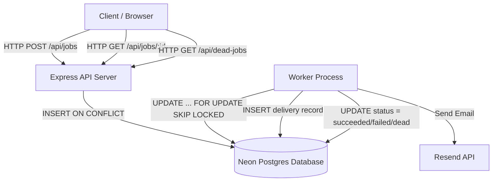
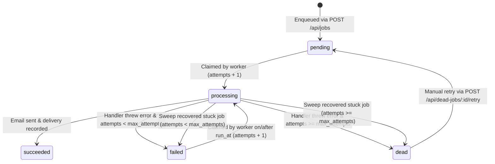

# Background Job Queue System

## What this is

This project is a resilient background job queue system built with Node.js, Express, TypeScript, and Postgres on Neon. It accepts ticket confirmation email requests over HTTP, stores them as jobs in a database, and processes them asynchronously using a separate worker process. Failed email deliveries are retried with exponential backoff and jitter, and jobs that exhaust all retries move to a dead letter queue for human inspection and manual retry.

## How it works

### System Architecture

The project consists of two separate Node.js processes sharing a Postgres database and configuration options:

1. **Express API Server**: Receives HTTP requests to enqueue jobs or check job status. It writes job records to the database with status `pending` and immediately returns an HTTP response without sending emails or blocking.
2. **Postgres Database**: Stores the `jobs` table (job state, payload, attempts, errors), `email_deliveries` table (record of sent emails), and `schema_migrations` table (applied database migrations).
3. **Worker Process**: Periodically claims pending or failed jobs from Postgres using an atomic database query, builds and sends emails via Resend, records deliveries, and manages retry backoff or dead letter transitions.
4. **Resend API**: External email delivery service invoked by the worker to dispatch confirmation emails.



### Job Lifecycle State Diagram

Every job transitions strictly between five allowed status values (`pending`, `processing`, `succeeded`, `failed`, `dead`):



## Setup from a fresh clone

Follow these steps to set up and run the project from a fresh clone:

```bash
# 1. Install dependencies
npm install

# 2. Copy the environment template and fill in your credentials
cp .env.example .env
# Edit .env with your Neon DATABASE_URL, RESEND_API_KEY, and EMAIL_FROM

# 3. Run database migrations
npm run migrate

# 4. Start the Express API server (Development mode)
npm run dev:api

# 5. In a separate terminal, start the worker process (Development mode)
npm run dev:worker
```

## Environment variables

Environment variables are loaded from `.env` at startup using `dotenv`. Missing required variables cause the process to exit immediately with a fatal error message.

| Variable | Required | Default | Description |
| --- | --- | --- | --- |
| `DATABASE_URL` | Yes | - | Neon Postgres connection string with SSL enabled. |
| `RESEND_API_KEY` | Yes | - | API key for authenticating with Resend email service. |
| `EMAIL_FROM` | Yes | - | Verified sender email address (e.g., `onboarding@resend.dev`). |
| `PORT` | No | `3000` | Port on which the Express API server listens. |
| `MAX_ATTEMPTS` | No | `5` | Maximum execution attempts allowed per job. |
| `BACKOFF_BASE_MS` | No | `1000` | Base delay in milliseconds for exponential retry backoff. |
| `BACKOFF_JITTER_MS` | No | `500` | Maximum random jitter in milliseconds added to backoff delay. |
| `CONCURRENCY` | No | `3` | Maximum number of concurrent jobs a worker process handles at once. |
| `POLL_INTERVAL_MS` | No | `1000` | Polling interval in milliseconds for workers checking for claimable jobs. |
| `STUCK_TIMEOUT_MS` | No | `300000` | Duration in ms after which a processing job is deemed stuck (5 min). |
| `SWEEP_INTERVAL_MS` | No | `30000` | Interval in ms between background stuck job recovery sweeps (30 sec). |
| `WORKER_ID` | No | Random | Unique text identifier for the worker process instance. |
| `EMAIL_MODE` *(Test Knob)* | No | `live` | Email sending mode: `live` calls Resend API; `dry` skips Resend and returns fake message ID. |
| `SIMULATE_FAILURE_RATE` *(Test Knob)* | No | `0` | Probability (0 to 1) that handler throws a simulated error before sending. |
| `SIMULATE_DELAY_MS` *(Test Knob)* | No | `0` | Artificial wait duration in ms inside job handler before sending. |
| `SIMULATE_CRASH_AFTER_SEND` *(Test Knob)* | No | `false` | When `true`, worker process exits (`process.exit(1)`) immediately after Resend call on attempt 1. |

## Configuration

All system tunables and default values reside in `src/config.ts`. Handler and worker modules import from `src/config.ts` directly; no numerical constants or limits are hardcoded inside route handlers or worker logic.

| Tunable Variable | Default Value | Purpose |
| --- | --- | --- |
| `maxAttempts` | `5` | Threshold after which failed attempts move job to `dead` state. |
| `backoffBaseMs` | `1000` | Base multiplier for computing exponential retry delay (`base * 2^attempts`). |
| `backoffJitterMs` | `500` | Upper bound for random noise added to delay to prevent thundering herds. |
| `concurrency` | `3` | Worker in-flight execution cap. |
| `pollIntervalMs` | `1000` | Sleep duration between worker claim queries when queue is idle. |
| `stuckTimeoutMs` | `300000` (5 min) | Time threshold for marking unacknowledged `processing` jobs as stuck. |
| `sweepIntervalMs` | `30000` (30 sec) | Interval between periodic stuck job recovery scans. |
| `port` | `3000` | HTTP port for Express API. |

## API reference

All API responses follow standard JSON envelope shapes:
- **Success Envelope**: `{ "data": ... }` (with optional `"meta": { ... }`)
- **Error Envelope**: `{ "error": { "code": "...", "message": "..." } }`

---

### 1. Enqueue Job

- **Method / Path**: `POST /api/jobs`
- **Headers**:
  - `Content-Type: application/json`
  - `Idempotency-Key`: Required string (1 to 200 characters).
- **Request Body**:
  ```json
  {
    "type": "send_ticket_confirmation",
    "payload": {
      "to": "delivered@resend.dev",
      "recipientName": "Alice Smith",
      "eventTitle": "Tech Conference 2026",
      "ticketId": "TC-998811"
    }
  }
  ```
- **Returned Status Codes**:
  - `202 Accepted`: New job created.
  - `200 OK`: Key previously processed with identical payload (duplicate).
  - `400 Bad Request`: Missing `Idempotency-Key` header or malformed JSON.
  - `409 Conflict`: `Idempotency-Key` previously used with a different payload (`IDEMPOTENCY_CONFLICT`).
  - `422 Unprocessable Entity`: Body validation error (e.g. `payload.to must be a valid email`).
  - `500 Internal Server Error`: Unhandled server exception.
- **cURL Example**:
  ```bash
  curl -i -X POST http://localhost:3000/api/jobs \
    -H "Content-Type: application/json" \
    -H "Idempotency-Key: ticket-confirmation/TC-998811" \
    -d '{
      "type": "send_ticket_confirmation",
      "payload": {
        "to": "delivered@resend.dev",
        "recipientName": "Alice Smith",
        "eventTitle": "Tech Conference 2026",
        "ticketId": "TC-998811"
      }
    }'
  ```
- **Example Response (202 Accepted)**:
  ```json
  {
    "data": {
      "id": "3abbbaec-42ab-4c74-942a-a0c08b98d4c7",
      "type": "send_ticket_confirmation",
      "status": "pending",
      "attempts": 0,
      "maxAttempts": 5,
      "lastError": null,
      "runAt": "2026-09-28T04:12:37.290Z",
      "createdAt": "2026-09-28T04:12:37.290Z"
    },
    "meta": {
      "duplicate": false
    }
  }
  ```

---

### 2. Get Job Status

- **Method / Path**: `GET /api/jobs/:id`
- **Returned Status Codes**:
  - `200 OK`: Job found (payload omitted to protect recipient privacy).
  - `404 Not Found`: `:id` is not a valid UUID or does not exist.
  - `500 Internal Server Error`: Unhandled server exception.
- **cURL Example**:
  ```bash
  curl -i http://localhost:3000/api/jobs/3abbbaec-42ab-4c74-942a-a0c08b98d4c7
  ```
- **Example Response (200 OK)**:
  ```json
  {
    "data": {
      "id": "3abbbaec-42ab-4c74-942a-a0c08b98d4c7",
      "type": "send_ticket_confirmation",
      "status": "pending",
      "attempts": 0,
      "maxAttempts": 5,
      "lastError": null,
      "runAt": "2026-09-28T04:12:37.290Z",
      "startedAt": null,
      "finishedAt": null,
      "createdAt": "2026-09-28T04:12:37.290Z"
    }
  }
  ```

---

### 3. List Dead Jobs

- **Method / Path**: `GET /api/dead-jobs`
- **Returned Status Codes**:
  - `200 OK`: Returns latest 50 jobs with status `dead`.
- **cURL Example**:
  ```bash
  curl -i http://localhost:3000/api/dead-jobs
  ```
- **Example Response (200 OK)**:
  ```json
  {
    "data": [
      {
        "id": "da338b5d-7bd8-4b13-8489-d1d68ab8cf8b",
        "type": "send_ticket_confirmation",
        "payload": {
          "to": "delivered@resend.dev",
          "recipientName": "Dead Page Demo",
          "eventTitle": "Dead Letter Festival",
          "ticketId": "DEAD-DEMO-99"
        },
        "attempts": 5,
        "maxAttempts": 5,
        "lastError": "Simulated failure",
        "createdAt": "2026-09-28T11:01:09.643Z",
        "finishedAt": "2026-09-28T11:01:21.091Z"
      }
    ]
  }
  ```

---

### 4. Retry Dead Job

- **Method / Path**: `POST /api/dead-jobs/:id/retry`
- **Returned Status Codes**:
  - `200 OK`: Job reset to `pending` status with `attempts = 0`.
  - `404 Not Found`: `:id` is not a valid UUID or job does not exist.
  - `409 Conflict`: Job exists but is not in `dead` state (`NOT_DEAD`).
- **cURL Example**:
  ```bash
  curl -i -X POST http://localhost:3000/api/dead-jobs/da338b5d-7bd8-4b13-8489-d1d68ab8cf8b/retry
  ```
- **Example Response (200 OK)**:
  ```json
  {
    "data": {
      "id": "da338b5d-7bd8-4b13-8489-d1d68ab8cf8b",
      "type": "send_ticket_confirmation",
      "status": "pending",
      "attempts": 0,
      "maxAttempts": 5,
      "lastError": "Simulated failure",
      "runAt": "2026-09-28T11:02:22.898Z",
      "createdAt": "2026-09-28T11:01:09.643Z"
    }
  }
  ```

---

### 5. Health Check

- **Method / Path**: `GET /health`
- **Returned Status Codes**:
  - `200 OK`: API and Postgres connection are operational.
- **cURL Example**:
  ```bash
  curl -i http://localhost:3000/health
  ```
- **Example Response (200 OK)**:
  ```json
  {
    "data": {
      "status": "ok"
    }
  }
  ```

## Design decisions

1. **Postgres as Queue vs. Redis / Dedicated Queue Library (e.g. BullMQ)**
   - *Alternative Considered*: Redis with BullMQ or RabbitMQ.
   - *Why Lost*: Using Postgres avoids adding secondary infrastructure, guarantees transactional consistency, and allows writing atomic claim queries directly in SQL (`FOR UPDATE SKIP LOCKED`).

2. **`failed` vs. `dead` States**
   - *Alternative Considered*: A single error state.
   - *Why Lost*: Distinguishing `failed` (transient error, pending automatic retry) from `dead` (permanent failure requiring human intervention) prevents infinite retry loops and establishes a clean dead-letter queue workflow.

3. **Counting Attempts at Claim Time instead of Failure Time**
   - *Alternative Considered*: Incrementing attempts when a handler throws an error.
   - *Why Lost*: Incrementing at claim time ensures that if a worker process crashes mid-execution (SIGKILL), the attempt count is already recorded, preventing endless re-execution loops without attempt tracking.

4. **Claim Query with `FOR UPDATE SKIP LOCKED`**
   - *Alternative Considered*: Two-step read-then-write query (`SELECT ...` followed by `UPDATE ...`).
   - *Why Lost*: Two-step queries create race conditions where multiple workers read the same job. `FOR UPDATE SKIP LOCKED` locks the candidate row instantly and forces other workers to skip to the next available row without blocking.

5. **Exponential Backoff with Jitter**
   - *Alternative Considered*: Fixed retry intervals or pure exponential backoff.
   - *Why Lost*: Pure exponential backoff causes thundering herd problems where many jobs failing at the same time retry simultaneously. Adding random jitter (`base * 2^attempts + random(0, jitter)`) spreads retries over time (located in [`src/worker/backoff.ts`](file:///Users/mac/Desktop/Jobs%20Project/src/worker/backoff.ts#L13)).

6. **Two Layers of Duplicate Protection**
   - *Alternative Considered*: Single protection layer in application code.
   - *Why Lost*: Application-level checks fail during concurrent worker races. Layer 1 uses Resend's API idempotency key (`idempotencyKey: job.id`), and Layer 2 uses a Postgres database constraint (`CONSTRAINT email_deliveries_job_unique UNIQUE (job_id)`).

7. **Honest Limit of Duplicate Protection**
   - *Alternative Considered*: Assuming Resend's idempotency key protection is permanent.
   - *Why Lost*: Resend idempotency keys expire after 24 hours. If a job is manually retried after 24 hours, Resend will treat it as a new request; protection relies entirely on Layer 2 (`email_deliveries` database check).

8. **At-Least-Once Delivery Choice**
   - *Alternative Considered*: Exactly-once processing guarantees.
   - *Why Lost*: Distributed network boundaries make true exactly-once processing impossible. Designing for at-least-once delivery with idempotent handlers ensures system reliability under worker crashes.

9. **Stuck Job Recovery Sweep Timeout**
   - *Alternative Considered*: Short recovery timeout or manual recovery only.
   - *Why Lost*: `stuckTimeoutMs` must exceed the slowest legitimate job duration (5 minutes default) to ensure active jobs are not prematurely marked as stuck and re-processed by another worker.

10. **Attempt-Number Guard on Finishing Updates**
    - *Alternative Considered*: Unconditional `UPDATE jobs SET status = 'succeeded' WHERE id = $1`.
    - *Why Lost*: If a slow worker finishes after being marked stuck, an unconditional update would overwrite state. `WHERE id = $1 AND status = 'processing' AND attempts = $2` ensures stale worker updates are ignored.

11. **Test-Only Knobs & Dry Mode**
    - *Alternative Considered*: Mocking libraries or manual code edits during testing.
    - *Why Lost*: Configurable test knobs (`EMAIL_MODE=dry`, `SIMULATE_FAILURE_RATE`, etc.) allow executing 50-job load tests without exceeding third-party email provider rate limits or quota boundaries.

## Scope decisions

- **Unauthenticated Dead Letter Queue**: The `GET /api/dead-jobs` and `POST /api/dead-jobs/:id/retry` endpoints and the `/dead.html` web interface expose recipient email addresses and allow manual retries without authentication. This was an explicit scope decision based on project specifications and **must not be deployed to production without adding authentication middleware**.

## Break-it results

| Test | What was done | Result | Evidence link |
| --- | --- | --- | --- |
| 1. 50 jobs & concurrency cap | Enqueued 50 jobs with worker cap=3 | TO FILL | [evidence/test1.png](evidence/test1.png) |
| 2. 100% failure to dead | Ran worker with failure rate=1.0 | TO FILL | [evidence/test2.png](evidence/test2.png) |
| 3. Kill mid-job & recovery | Killed worker mid-execution (SIGKILL) | TO FILL | [evidence/test3.png](evidence/test3.png) |
| 4. Same idempotency key twice | Sent identical request payload twice | TO FILL | [evidence/test4.png](evidence/test4.png) |
| 5. Two workers at once | Ran two workers concurrently on 30 jobs | TO FILL | [evidence/test5.png](evidence/test5.png) |
| 6. Double run output | Verified email delivery row count | TO FILL | [evidence/test6.png](evidence/test6.png) |
| 7. Crash after send | Process exited immediately post-send | TO FILL | [evidence/test7.png](evidence/test7.png) |
